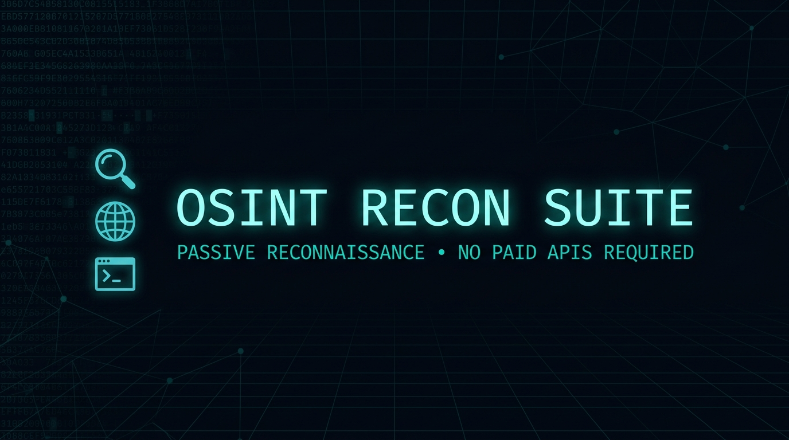
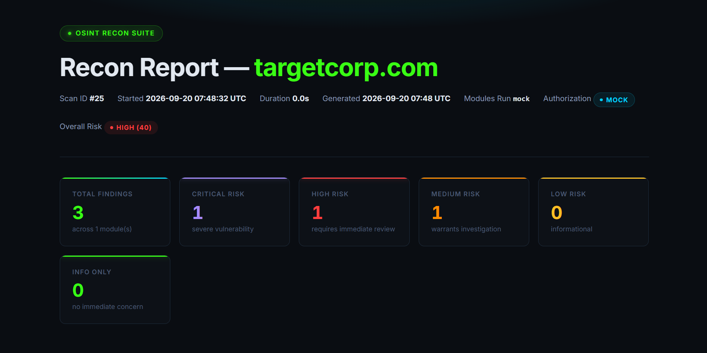
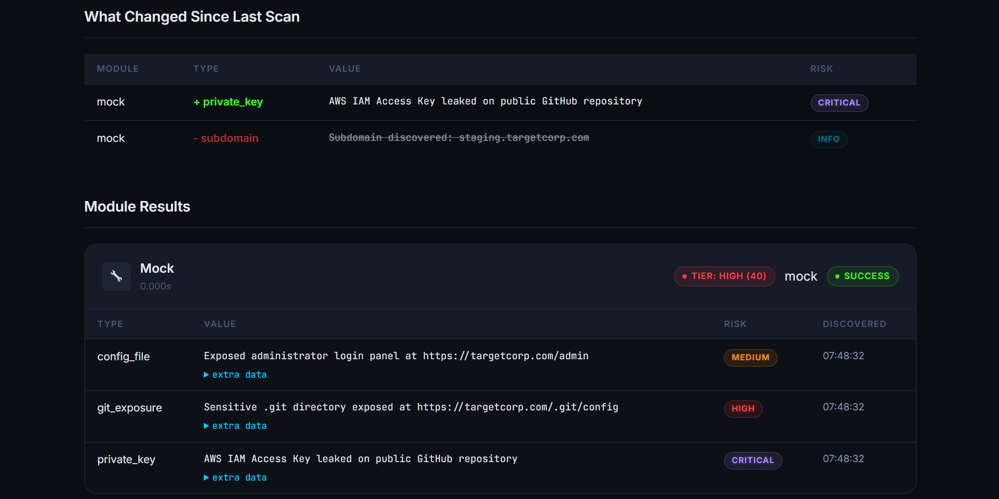

<!-- PROJECT SHIELDS -->
[![Python][python-shield]][python-url]
[![Stars][stars-shield]][stars-url]
[![Forks][forks-shield]][forks-url]
[![Issues][issues-shield]][issues-url]
[](#)

<br />

<!-- COVER -->
<p align="center">
  
</p>

<br />

<!-- ABOUT -->
## About The Project

**OSINT Recon Suite** is a modular, passive open-source intelligence tool. Give it a domain name or company name, and it automatically runs WHOIS lookups, DNS recon, subdomain discovery, attack surface mapping, exposed document scanning, file metadata extraction, and social media footprint analysis. Everything is packaged into a single, self-contained HTML risk report you can open in any browser.

> [!NOTE]
> **Stretch Goal Addition:** The suite now includes an 8th **Breach Check Module**! This module passively collects emails discovered during the scan (by the original 7 modules) and checks them against the Have I Been Pwned (HIBP) API. Note: This requires a paid HIBP API key set in the `HIBP_API_KEY` environment variable.

**No paid API keys. No server. No GUI needed.**

### Built With

* 🐍 Python 3.11+
* ⚡ asyncio - concurrent scanning without threads
* 💻 Rich - animated terminal progress bars, stylized CLI UI & findings tables
* 🗄️ SQLite - persistent scan history with confirmation audit trails
* 🎨 Jinja2 - self-contained dark-mode HTML reports
* 🔒 All free, public endpoints (crt.sh, Shodan InternetDB, ipapi.co, GitHub)

---

<!-- QUICKSTART -->
## ⚡ 30-Second Quickstart

> [!TIP]
> **Recommended:** Install globally via `pipx` to run from anywhere without manually managing virtual environments.

### 📦 Recommended Install (pipx)

**Option 1 (One-Liner):**
```bash
pipx install git+https://github.com/zachhallare/osint-recon-suite.git
```

**Option 2 (From Clone):**
```bash
git clone https://github.com/zachhallare/osint-recon-suite.git
cd osint-recon-suite
pipx install .
```

After installation, launch the interactive menu from anywhere by typing `recon-suite`.

---

### 📜 Alternative Install (Standalone Scripts)

> No manual setup required. The launcher creates the virtual environment, installs dependencies, and walks you through the rest.

### macOS

```bash
git clone https://github.com/zachhallare/osint-recon-suite.git
cd osint-recon-suite
chmod +x scripts/run.sh scripts/run.command scripts/uninstall.sh scripts/uninstall.command
./scripts/run.sh
```

> **Finder shortcut:** Double-click **`scripts/run.command`** in Finder and Terminal opens automatically.

### Linux (Kali, Ubuntu, Debian, Arch, Fedora)

```bash
# Kali / Debian / Ubuntu - ensure prerequisites first (one-time):
# sudo apt install -y python3 python3-venv python3-pip whois git

git clone https://github.com/zachhallare/osint-recon-suite.git
cd osint-recon-suite
chmod +x scripts/run.sh scripts/uninstall.sh
./scripts/run.sh
```

### Windows

```bat
git clone https://github.com/zachhallare/osint-recon-suite.git
cd osint-recon-suite
scripts\run.bat
```

> **Explorer shortcut:** Double-click **`scripts\run.bat`** in Explorer and CMD opens automatically.

> [!NOTE]
> **macOS / Linux only - make scripts executable once after cloning (from the repo root):**
> ```bash
> chmod +x scripts/run.sh scripts/run.command scripts/uninstall.sh scripts/uninstall.command
> ```
> Not needed on Windows.

---

<!-- USAGE -->
## Usage

If you installed via `pipx`, you can use the `recon-suite` command globally. If you used the standalone scripts, replace `recon-suite` with `./scripts/run.sh` (macOS/Linux) or `scripts\run.bat` (Windows).

### Interactive Menu

Run the tool without arguments to launch the interactive menu, which prompts you for a target and scan mode:

```bash
recon-suite
```

```text
==================================================
        OSINT Recon Suite - Interactive Menu
==================================================
  [1] Start a new recon scan
  [2] View past scan history
  [3] Uninstall / remove scan data
  [0] Exit
==================================================
Select an option:
```

### Command Line Interface

You can also pass arguments directly for automation or quick scans:

```bash
# Basic usage
recon-suite example.com              # live scan (prompts for HTML report)
recon-suite "Acme Corp"              # target resolution (mandatory prompt to confirm domain, ignores --no-confirm)

# Advanced options
recon-suite example.com --mock       # safe test - no network calls
recon-suite example.com --html       # automatically generate HTML report
recon-suite example.com --no-html    # skip HTML report (terminal summary only)
recon-suite example.com --no-confirm # unattended / CI mode (audited as BYPASSED)
recon-suite example.com --modules whois_dns,subdomain,breach_check  # allowlist modules
recon-suite example.com --skip social_media                # denylist modules
```

### Scan Features & Reporting

<p align="center">
  
</p>
<p align="center">
  
</p>
*A sample mock report showcasing risk scoring, module findings, and differential scan comparisons.*

- **Terminal UI**: Live animated progress indicators during scanning, followed by a streamlined findings summary table.
- **Authorization Audit Trail**: Every run logs its authorization status (`INTERACTIVE`, `BYPASSED`, or `MOCK`) in SQLite, on the CLI footer, and as an audit badge in the HTML report.
- **Optional HTML Report**: Generated on demand (`--html` flag or interactive prompt). Saved to `reports/<target>_run<id>_<timestamp>.html` and self-contained with no external server or CDN dependencies.

**Safe first run (zero network activity):**
```bash
recon-suite example.com --mock
```

---

<!-- UNINSTALL -->
## Uninstall

### pipx Install

If you installed globally via `pipx`, simply run:

```bash
pipx uninstall osint-recon-suite
```

*(Note: To remove data files like SQLite and reports, use the interactive menu: `recon-suite` -> Option 3. Requires typing DELETE to confirm.)*

### Standalone Scripts Install

If you used the standalone launcher scripts, run the uninstaller:

```bash
./scripts/uninstall.sh          # macOS / Linux  (or double-click scripts/uninstall.command in Finder)
scripts\uninstall.bat           # Windows
```

The interactive uninstaller menu offers:
- **Option 1** - Remove scan data only (reports, database, logs). Keeps code and venv.
- **Option 2** - Full removal: everything above plus the virtualenv and entire repository directory. Requires typing `yes` to confirm.

---

<!-- DOCUMENTATION -->
## Documentation

| Guide | Description |
|-------|-------------|
| [docs/how-to-run.md](docs/how-to-run.md) | Full OS-specific setup guide (Kali Linux, WSL, headless servers, troubleshooting) |
| [docs/features.md](docs/features.md) | Module list, architecture, sample output, limitations |
| [docs/testing.md](docs/testing.md) | Test coverage table and how to run the offline test suite |
| [docs/project-structure.md](docs/project-structure.md) | Annotated directory and file tree |
| [docs/original-contribution.md](docs/original-contribution.md) | Novel design decisions and implementations |

---

<!-- DISCLAIMER -->
## Ethical Disclaimer

> This tool is for **passive, authorised reconnaissance only.**

- Only scan domains or infrastructure you **own or have explicit written permission** to test.
- The tool never attempts active exploitation, authentication bypass, or rate-limit evasion.
- Misuse may violate computer fraud laws in your jurisdiction (e.g. CFAA in the US, Computer Misuse Act in the UK).

---

<!-- CONTACT -->
## Contact

Zach Hallare - [github.com/zachhallare](https://github.com/zachhallare)

Project Link: [https://github.com/zachhallare/osint-recon-suite](https://github.com/zachhallare/osint-recon-suite)

---

<!-- MARKDOWN LINKS & IMAGES -->
[python-shield]: https://img.shields.io/badge/Python-3.11%2B-3776AB?style=flat-square&logo=python&logoColor=white
[python-url]: https://www.python.org/downloads/
[stars-shield]: https://img.shields.io/github/stars/zachhallare/osint-recon-suite.svg?style=flat-square
[stars-url]: https://github.com/zachhallare/osint-recon-suite/stargazers
[forks-shield]: https://img.shields.io/github/forks/zachhallare/osint-recon-suite.svg?style=flat-square
[forks-url]: https://github.com/zachhallare/osint-recon-suite/network/members
[issues-shield]: https://img.shields.io/github/issues/zachhallare/osint-recon-suite.svg?style=flat-square
[issues-url]: https://github.com/zachhallare/osint-recon-suite/issues